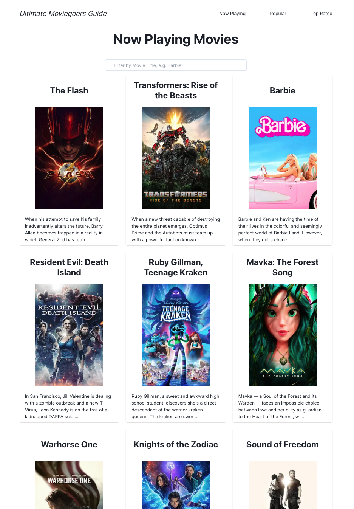
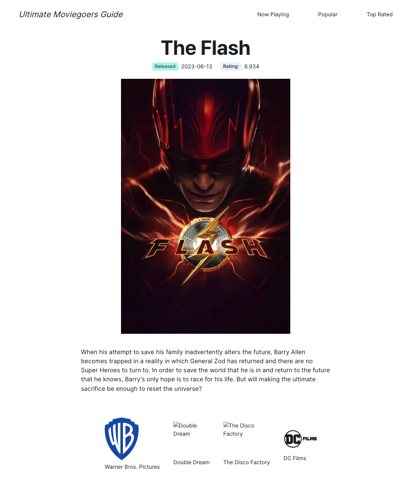

# Ultimate Moviegoers Guide

A Next.js 13 (sans App Router) application that utilizes the The Movie Database API

## Routes

- `/now_playing`: movies in theater
- `/popular`: popular movies
- `/top_rated`: top rated movies
- `/movie/{id}`: individual movies

### Movies Page

### Single Page

